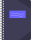
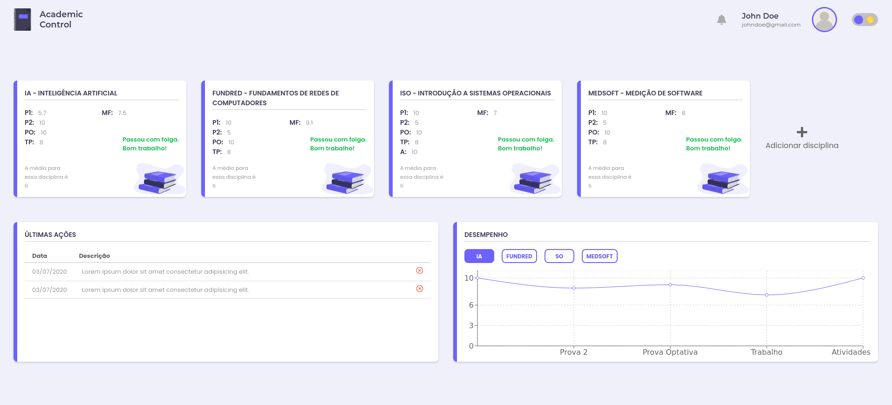
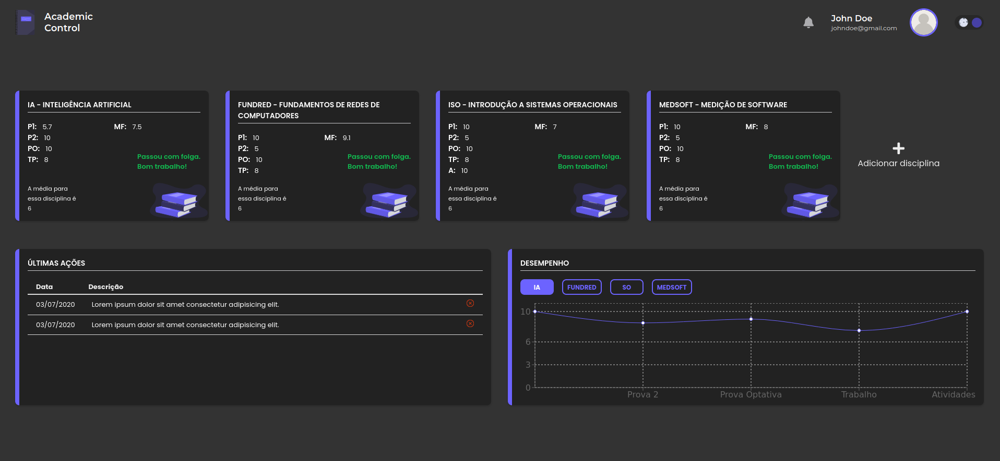

    

<h1 align="center">Academic Control</h1>

<h2 align="center">
    A simple and efficient system for monitoring your academic grades 🗒️
</h2>

 

    
    
    

 

    
    

 

    <a href="#goal">Goal</a> •
    <a href="#technologies">Technologies</a> •
    <a href="#features">Features</a> •
    <a href="#author">Author</a>

 

<h2 id="goal">🎯️ Goal</h2>

 

    The goal of Academic Control is to monitor each user's academic performance so that they can have control of their grades and have an easy view of their situation in each discipline.

 

<h2 id="features">💻️ Features</h2>

 

- [ ] User registration
- [ ] User authentication
- [ ] Disciplines registration
- [ ] Disciplines monitoring
- [ ] Actions report
- [ ] Performance graph

 

<h2 id="technologies">🛠 Technologies</h2>

 

The following tools were used in the development of the project:

- [React](https://pt-br.reactjs.org/)
- [TypeScript](https://www.typescriptlang.org/)
- [Styled Components](https://styled-components.com/)

 

<h2 id="author">✏️️ Author</h2>

 

<a href="https://blog.rocketseat.com.br/author/thiago/">
    
     
    <strong>Lucas Santos</strong>
</a>

 

Get in touch!

<h4 align="center">
	🚧  Academic Control 🗒️ In development...  🚧
</h4>
